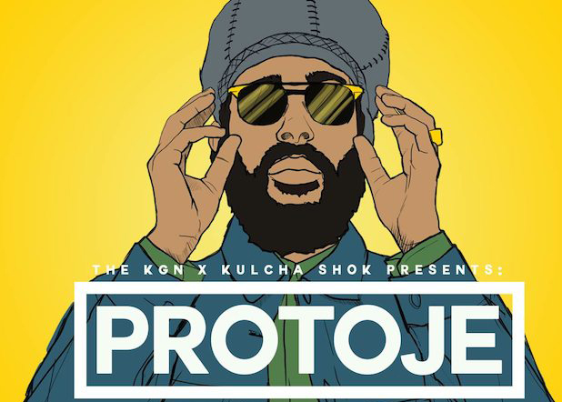

<a name="readme-top"></a>

<div align="center">

  
  <br/>
  
  <br/>

  <h3><b>Protoje Concert</b></h3>
  <h3><b>Capstone Microverse Project Module 1</b></h3>

</div>

# 📗 Table of Contents

- [📖 About the Project](#about-project)
  - [🛠 Built With](#built-with)
    - [Tech Stack](#tech-stack)
    - [Key Features](#key-features)
- [🧑🏻‍💻 Live Demo](#live-demo)
- [💻 Getting Started](#getting-started)
  - [Prerequisites](#prerequisites)
  - [Clone](#prerequisites)
- [👥 Authors](#authors)
- [🔭 Future Features](#future-features)
- [🤝 Contributing](#contributing)
- [⭐️ Show your support](#support)
- [🙏 Acknowledgements](#acknowledgements)
- [❓ FAQ](#faq)
- [📝 License](#license)

# 📖 Protoje Concert - Capstone Micorverse Project Module 1<a name="about-project"></a>

> A fictitious web page to demonstrate the skills learned in html, css and DOM management with Javascript.

## 🛠 Built With <a name="built-with"></a>

### Tech Stack <a name="tech-stack"></a>

<details>
  <summary>Client</summary>
  <ul>
    <li><a href="https://en.wikipedia.org/wiki/HTML">Html</a></li>
    <li><a href="https://en.wikipedia.org/wiki/CSS">Css</a></li>
    <li><a href="https://en.wikipedia.org/wiki/JavaScript">Vanilla Javascript</a></li>
  </ul>
</details>

<!-- Features -->

### Key Features <a name="key-features"></a>

- **Mobile version**

  - **Hamburger menu**
  - **Heading section**
  - **Main Program section**
  - **Featured Performers section**
  - **Load more button**
  - **About Page**

  **Desktop version**

  - **Social media menu**
  - **Top bar menu**
  - **Heading section**
  - **Main Program section**
  - **Featured Performers section**
  - **About Page**

<p align="right">(<a href="#readme-top">back to top</a>)</p>

## 🧑🏻‍💻 Live Demo <a name="live-demo"></a>

<a href="https://chelobotix.github.io/Capstone-project-Protoje-concert/">Visit the Live Demo</a>
<br/>
<a href="https://www.loom.com/share/b2074e5004a04aae9bcb8802979bbf44">Loom Presentation Video</a>

## 💻 Getting Started <a name="getting-started"></a>

To get a local copy up and use as a template for your own portafolio site, follow these steps.

### Prerequisites

In order to run this project you need: git installed in your system

### Clone

Clone this repository to your desired folder:

```sh
  git clone https://github.com/chelobotix/Capstone-project-Protoje-concert.git
```

<p align="right">(<a href="#readme-top">back to top</a>)</p>

<!-- AUTHOR -->

## 👥 Author <a name="authors"></a>

👤 **Author1**

: Marcelo Alarcon Barrenechea

🇧🇴 Bolivia 💓

- GitHub: [@chelobotix](https://github.com/chelobotix)
- Linkedin: [Marcelo Alarcon](https://www.linkedin.com/in/marceloalarconb/)

<p align="right">(<a href="#readme-top">back to top</a>)</p>

## 🔭 Future Features <a name="future-features"></a>

- [ ] **[Buy Ticket section]**

<p align="right">(<a href="#readme-top">back to top</a>)</p>

## 🤝 Contributing <a name="contributing"></a>

Contributions, issues, and feature requests are welcome!

<p align="right">(<a href="#readme-top">back to top</a>)</p>

## ⭐️ Show your support <a name="support"></a>

If you like this project please let me know

<p align="right">(<a href="#readme-top">back to top</a>)</p>

## 🙏 Acknowledgments <a name="acknowledgements"></a>

My mother. Let's play to the end together ❤️ with 🧠
<br/>
Cindy Shin. This project was adapted from Cindy Shin's <a href="https://www.behance.net/gallery/29845175/CC-Global-Summit-2015">template</a>

<p align="right">(<a href="#readme-top">back to top</a>)</p>

## ❓ FAQ <a name="faq"></a>

- **Is there any restriction to adapting the page to another concert??**

  - No, but please don't forget to link for the original <a href="https://www.behance.net/gallery/29845175/CC-Global-Summit-2015">template</a>

- **Can I change the original colors or assign a new color palette?**

  - Yeah, no problem

<p align="right">(<a href="#readme-top">back to top</a>)</p>

## 📝 License <a name="license"></a>

This project is [MIT](<a href="https://github.com/chelobotix/Capstone-project-Protoje-concert/blob/html-skeleton-and-css-style/license">License</a>) licensed.

<a href="https://github.com/chelobotix/Capstone-project-Protoje-concert/blob/html-skeleton-and-css-style/license">License</a>

<p align="right">(<a href="#readme-top">back to top</a>)</p>
